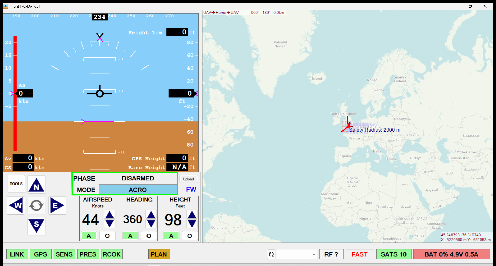

# **Test Report**
----------------------------
Flight Phase changed to DISARMED
----------------------------
----------------------------
Flight Mode changed to ACRO
----------------------------
| **Title: Phase_And_Mode_When_Connected_To_SC3.png** |
| :---------------------------- |
|  |
| *Figure1: Test Image for comparing results* |
----------------------------
**Phase_And_Mode_When_Connected_To_SC3.png** is *matched* with part of **SCFlight_Window.png** below: 

----------------------------
| **Title: SCFlight_Window.png** |
| :---------------------------- |
|  |
| *Figure2: Results Image captured to check Test Image* |
----------------------------
Matched part identical to **Phase_And_Mode_When_Connected_To_SC3.png** *highlighted* with polygon in **matched_region_highlighted.png** below: 

----------------------------
| **Title: matched_region_highlighted.png** |
| :---------------------------- |
|  |
| *Figure3: Test Image is identified and marked with polygon* |
----------------------------
**Test Result**: *PASS*
----------------------------
