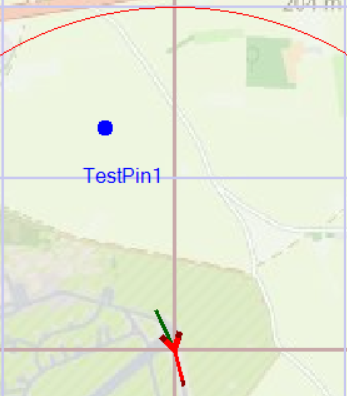

# **Test Report**
| **Title: NavMap_HomeUAV_DefaultLocation.png** |
| :---------------------------- |
|  |
| *Figure1: Test Image for comparing results* |
----------------------------
**NavMap_HomeUAV_DefaultLocation.png** is *matched* with part of **SCFlight_Window_Default.png** below: 

----------------------------
| **Title: SCFlight_Window_Default.png** |
| :---------------------------- |
|  |
| *Figure2: Results Image captured to check Test Image* |
----------------------------
Matched part identical to **NavMap_HomeUAV_DefaultLocation.png** *highlighted* with polygon in **matched_region_highlighted_NavMap_HomeUAV_DefaultLocation.png** below: 

----------------------------
| **Title: matched_region_highlighted_NavMap_HomeUAV_DefaultLocation.png** |
| :---------------------------- |
|  |
| *Figure3: Test Image is identified and marked with polygon* |
| **Title: NavMap_HotKeys_PinSpotForm_window.png** |
| :---------------------------- |
|  |
| *Figure1: Test Image for comparing results* |
----------------------------
**NavMap_HotKeys_PinSpotForm_window.png** is *matched* with part of **SCFlight_Window_PinSpotForm_window.png** below: 

----------------------------
| **Title: SCFlight_Window_PinSpotForm_window.png** |
| :---------------------------- |
|  |
| *Figure2: Results Image captured to check Test Image* |
----------------------------
Matched part identical to **NavMap_HotKeys_PinSpotForm_window.png** *highlighted* with polygon in **matched_region_highlighted_NavMap_HotKeys_PinSpotForm_window.png** below: 

----------------------------
| **Title: matched_region_highlighted_NavMap_HotKeys_PinSpotForm_window.png** |
| :---------------------------- |
|  |
| *Figure3: Test Image is identified and marked with polygon* |
| **Title: NavMap_HotKeys_PinSpotForm_1.png** |
| :---------------------------- |
|  |
| *Figure1: Test Image for comparing results* |
----------------------------
**NavMap_HotKeys_PinSpotForm_1.png** is *matched* with part of **SCFlight_Window_PinSpotForm_1.png** below: 

----------------------------
| **Title: SCFlight_Window_PinSpotForm_1.png** |
| :---------------------------- |
|  |
| *Figure2: Results Image captured to check Test Image* |
----------------------------
Matched part identical to **NavMap_HotKeys_PinSpotForm_1.png** *highlighted* with polygon in **matched_region_highlighted_NavMap_HotKeys_PinSpotForm_1.png** below: 

----------------------------
| **Title: matched_region_highlighted_NavMap_HotKeys_PinSpotForm_1.png** |
| :---------------------------- |
|  |
| *Figure3: Test Image is identified and marked with polygon* |
| **Title: NavMap_HotKeys_PinSpotForm_2.png** |
| :---------------------------- |
|  |
| *Figure1: Test Image for comparing results* |
----------------------------
**NavMap_HotKeys_PinSpotForm_2.png** is *matched* with part of **SCFlight_Window_PinSpotForm_2.png** below: 

----------------------------
| **Title: SCFlight_Window_PinSpotForm_2.png** |
| :---------------------------- |
|  |
| *Figure2: Results Image captured to check Test Image* |
----------------------------
Matched part identical to **NavMap_HotKeys_PinSpotForm_2.png** *highlighted* with polygon in **matched_region_highlighted_NavMap_HotKeys_PinSpotForm_2.png** below: 

----------------------------
| **Title: matched_region_highlighted_NavMap_HotKeys_PinSpotForm_2.png** |
| :---------------------------- |
|  |
| *Figure3: Test Image is identified and marked with polygon* |
----------------------------
**Test Result**: *PASS*
----------------------------
