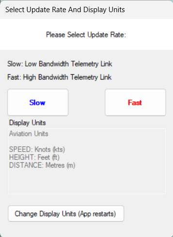
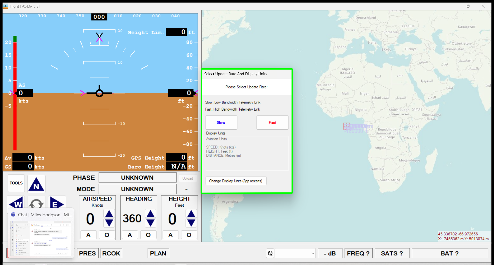

# **Test Report**
UpdateRate_Window.png is matched with part of SCFlight_With_UpdateRate_Window.png

Matched part highlighted with polygon in matched_region_highlighted.png

|  ||:--:|| *Figure1: Test Image for comparing results* |

*Figure2: Results Image captured to compare with Test Image*

