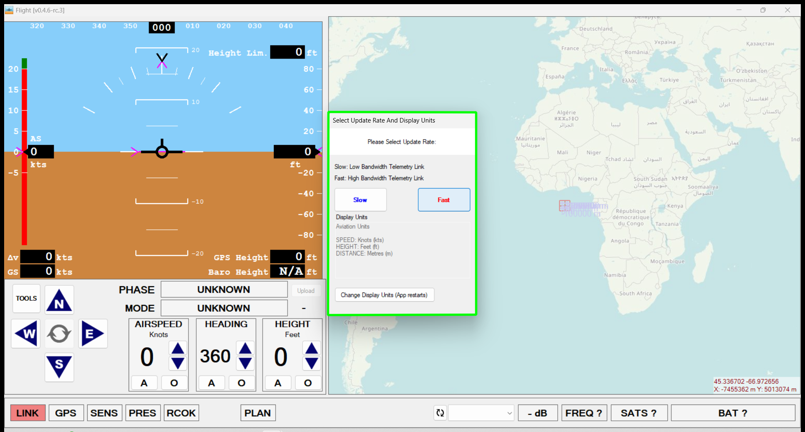

# **Test Report**
| **Title: UpdateRate_Window.png** |
| :---------------------------- |
|  |
| *Figure1: Test Image for comparing results* |
----------------------------
**UpdateRate_Window.png** is *matched* with part of **SCFlight_With_UpdateRate_Window.png** below: 

| **Title: SCFlight_With_UpdateRate_Window.png** |
| :---------------------------- |
|  |
| *Figure2: Results Image captured to check Test Image* |
----------------------------
Matched part identical to **UpdateRate_Window.png** *highlighted* with polygon in **matched_region_highlighted.png** below: 

| **Title: matched_region_highlighted.png** |
| :---------------------------- |
|  |
| *Figure3: Test Image is identified and marked with polygon* |
----------------------------
**Test Result:** *PASS*
